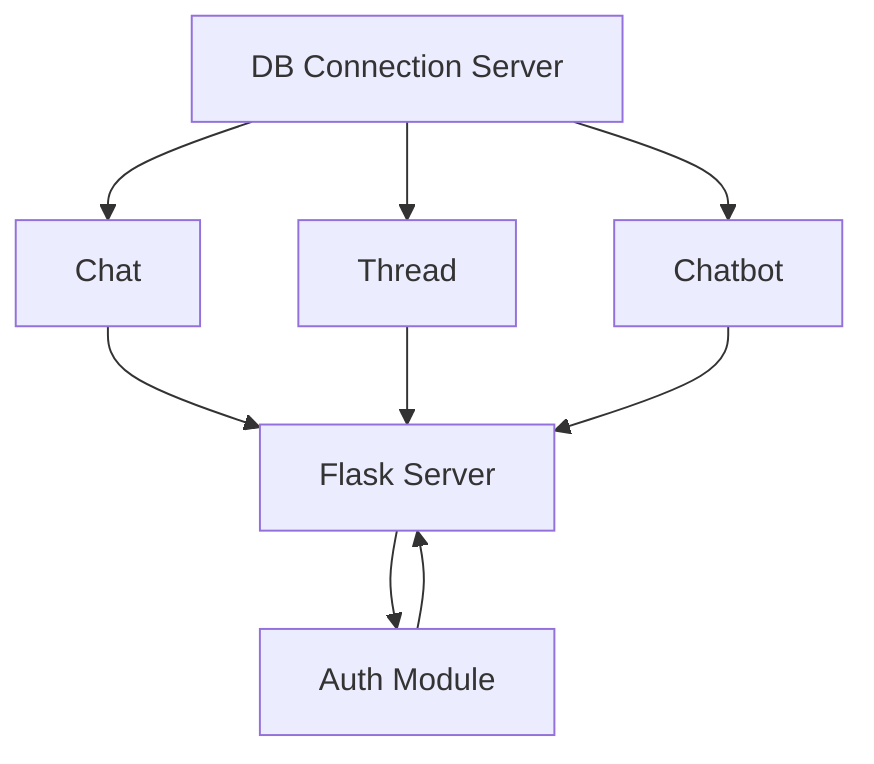
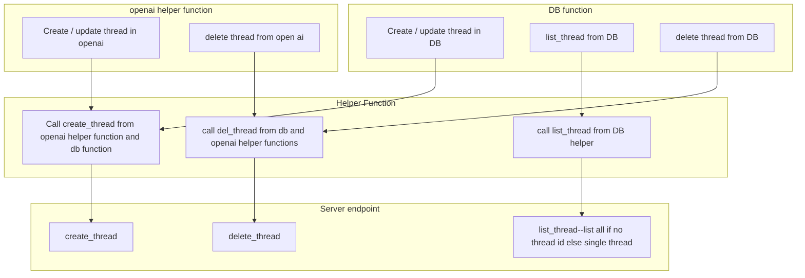
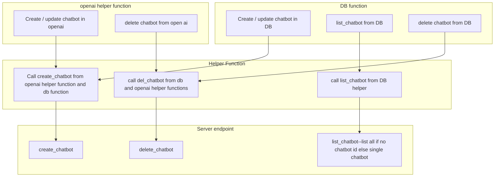
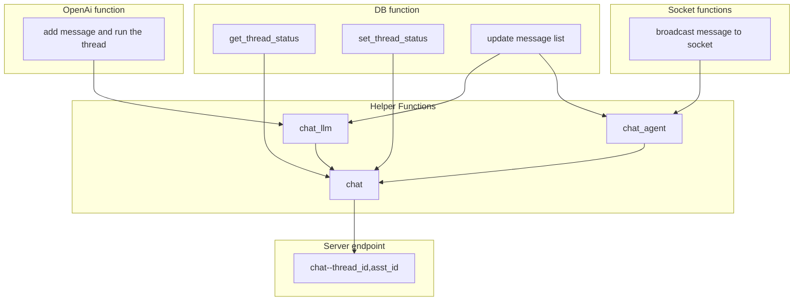
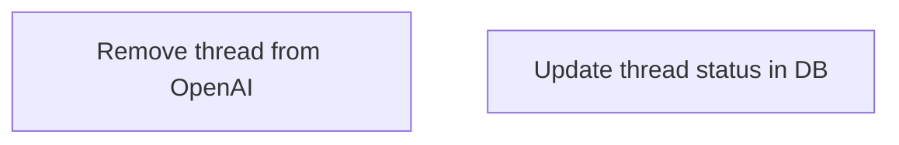

# Endpoint

```mermaid
 graph TD
    A[Flask Server]
    B[Thread]
    C[Chatbot]
    D[Auth Module]
    E[DB Connection Server]
    F[Chat]

    F --> A
    B --> A
    C --> A
    A --> D
    D --> A
    E --> B
    E --> C
    E --> F
```
# Thread

```mermaid
graph TD
    subgraph Server endpoint
        A[create_thread]
        E[list_thread--list all if no thread id else single thread]
        H[delete_thread]
    end

    subgraph DB function
        B[Create / update thread in DB]
        F[list_thread from DB]
        J[delete thread from DB]
    end
    subgraph openai helper function
        C[Create / update thread in openai]
        K[delete thread from open ai]
    end
    subgraph Helper Function
        D[Call create_thread from openai helper function and db function]
        G[call list_thread from DB helper]
        I[call del_thread from db and openai helper functions ]
    end

    C --> D
    B --> D 
    D --> A

    F --> G
    G --> E

    I --> H
    J --> I
    K --> I
```
# Chatbot

```mermaid
graph TD
    subgraph Server endpoint
        A[create_chatbot]
        E[list_chatbot--list all if no chatbot id else single chatbot]
        H[delete_chatbot]
    end

    subgraph DB function
        B[Create / update chatbot in DB]
        F[list_chatbot from DB]
        J[delete chatbot from DB]
    end
    subgraph openai helper function
        C[Create / update chatbot in openai]
        K[delete chatbot from open ai]
    end
    subgraph Helper Function
        D[Call create_chatbot from openai helper function and db function]
        G[call list_chatbot from DB helper]
        I[call del_chatbot from db and openai helper functions ]
    end

    C --> D
    B --> D 
    D --> A

    F --> G
    G --> E

    I --> H
    J --> I
    K --> I
```

# Chat

```mermaid
graph TD
    subgraph Server endpoint
        A[chat--thread_id,asst_id]
    end
    subgraph Helper Functions
        B[chat]
        C[chat_llm]
        D[chat_agent]

        C --> B
        D --> B
    end
    subgraph DB function
        E[get_thread_status]
        F[set_thread_status]
        I[update message list]
    end
    subgraph OpenAi function
        G[add message and run the thread]
    end
    subgraph Socket functions
        H[broadcast message to socket]
    end
    F --> B
    I --> C
    I --> D
    H --> D
    G --> C
    E --> B
    B --> A
```
# Chat End

```mermaid
graph TD
 A[Remove thread from OpenAI]
 B[Update thread status in DB]
```