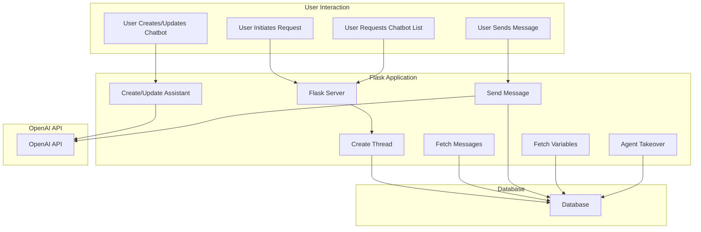

# Flask Chatbot Management Application

This application serves as the backend for managing chatbots and handling chat interactions using the OpenAI API. The application provides endpoints for creating and updating chatbots, managing chat threads, and sending and receiving messages.

## Key Features

### 1. **Thread Management**
   - **Create Thread (`/create_thread`)**:
     - Generates a new chat thread using the OpenAI API and registers it in the database.
   - **Get Threads (`/threads`)**:
     - Retrieves the list of chat threads from the database.
   - **Get Messages (`/threads/<thread_id>/messages`)**:
     - Fetches messages for a specific thread from the OpenAI API or the database, depending on the thread status.

### 2. **Chatbot Management**
   - **Create Chatbot (`/create_assistant`)**:
     - Allows users to create a new chatbot by specifying its name, instructions, model, and associated tools (with URLs).
   - **Update Chatbot (`/update_assistant`)**:
     - Updates an existing chatbot’s details.
   - **List Chatbots (`/chatbots`)**:
     - Fetches a list of all available chatbots.

### 3. **Chat Functionality**
   - **Send Message (`/chat`)**:
     - Sends a message to a chatbot. The application checks the thread's status (active or agent takeover) and routes the message accordingly.
   - **Agent Takeover (`/agent_takeover/<thread_id>`)**:
     - Handles the transition of a thread to agent takeover mode.

### 4. **Serve Embedded Chatbot**
   - **Serve Embedded Chatbot (`/chatbot`)**:
     - Serves an HTML template with an embedded chatbot, allowing users to integrate the chatbot into their websites.

### 5. **Variable Management**
   - **Fetch Variables (`/get_variables/<thread_id>/`)**:
     - Retrieves variables associated with a specific chat thread.

## Architecture Diagram



# Flask Chatbot Backend with MongoDB and OpenAI Integration

This application serves as the backend for managing chatbots, chat threads, and messages using Flask, MongoDB, and OpenAI's API. It provides a comprehensive solution for creating and managing chatbots and their interactions.

## Key Features

### 1. **Chatbot Management**
   - **Create Chatbot**: 
     - Creates a new chatbot (assistant) using the OpenAI API.
     - Stores related tools and their URLs in MongoDB.
   - **Update Chatbot**: 
     - Updates an existing chatbot's details and tools in MongoDB.
   - **Retrieve Tool**: 
     - Fetches a specific tool by its name and assistant ID from MongoDB.

### 2. **Thread Management**
   - **Create Thread**: 
     - Registers a new chat thread in MongoDB with a status of "active".
   - **Change Thread Status**: 
     - Updates the status of a thread in MongoDB (e.g., active, agent_takeover).
   - **Fetch Messages by Thread**: 
     - Retrieves messages associated with a specific thread ID from MongoDB.

### 3. **Message Handling**
   - **Create Message**: 
     - Creates a new message in a thread using the OpenAI API.
   - **Add Message to Thread**: 
     - Adds a new message to a specific thread in MongoDB.
   - **Transfer Messages to DB**: 
     - Transfers messages from OpenAI to MongoDB when a thread is canceled.

### 4. **Function Execution**
   - **Call Required Functions**: 
     - Executes functions required by the assistant and submits results back to the OpenAI API.
   - **Wait for Run Completion**: 
     - Handles the process of waiting for a thread run to complete, executing required actions during the process.

### 5. **Variable Management**
   - **Register Variables**: 
     - Stores variables related to a specific thread in MongoDB.
   - **Fetch Variables**: 
     - Retrieves variables for a specific thread from MongoDB.

## Architecture Diagram

```mermaid
graph TD
    subgraph Flask Server
        A[User Request]
        B[Flask Application]
        C[MongoDB Integration]
        D[OpenAI API Integration]
    end

    subgraph MongoDB
        E[function_collection]
        F[threads_collection]
        G[message_collection]
        H[variable_collection]
    end

    subgraph OpenAI API
        I[Create Assistant]
        J[Create Thread]
        K[Send Message]
        L[Run Thread]
        M[Wait for Run Completion]
        N[Handle Function Calls]
    end

    A --> B
    B --> C
    C --> E
    C --> F
    C --> G
    C --> H
    B --> D
    D --> I
    D --> J
    D --> K
    D --> L
    D --> M
    D --> N
